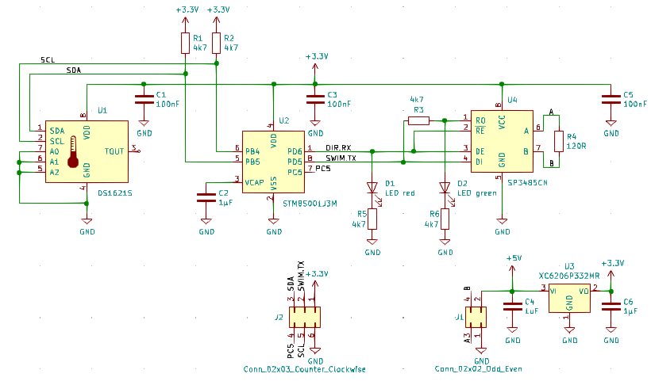
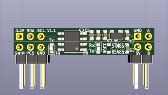

# A small STM88S001 Thermometer and Break-Out PCB with RS485 Interface 

](https://oshpark.com/assets/badge-5b7ec47045b78aef6eb9d83b3bac6b1920de805e9a0c227658eac6e19a045b9c.png)

This KiCad project provides a small PCB with an STM8S001J3M3, a RS485 interface and a DS1621S temperature sensor. Applications include [MODBUS with STM8 eForth](https://github.com/TG9541/stm8ef-modbus).

The STM8S001J3M3 is a member of the "STM8S Low Density" family that's based on the "STM8S Access Line" cross-breed STM8S903, which, compared with the STM8S003, has some ([undocumented](https://github.com/TG9541/stm8ef/wiki/STM8-Low-Density-Devices#stm8s001j3)) goodies.

The board is supported by [STM8 eForth](https://github.com/TG9541/stm8ef/) which means that it runs an interactive development system on the chip.

A µC with merrily 5 GPIO pins is a good shield against feature creep, but the following things "had" to be included:

* a narrow PCB for a cylindrical sensors with a diameter of 7mm
* 5V supply, 3.3V internal power supply with a LDO regulator
* signalling LEDs for RX/TX and RS485 direction 
* most GPIOs, including the I2C bus, and an analog input or timer output are available on 6 pin header

The design is simple:

Components occupy both sides of a PCB of 33.4mm x 1/4" (the minimal width supported by Oshpark).

On the front side there is the STM8S001J3M3, a 3.3V LDO XC6206 regulator, some passive component, and the RS485 signalling LEDs: 

A standard SP3485 or MAX3485 RS485 transceiver and the (optional) DS1621S thermometer chip are on the backside:

Care should be taken not to exceed 6V input supply voltage. The internal 3.3V power supply is available on a header pin and it should support about 150mA. 

Pin headers are optional: they allow the board to be used as a module for quickly building a MODBUS node with a "perfboard" (using I2C or GPIOs), but connecting wires directly is also possible. 
